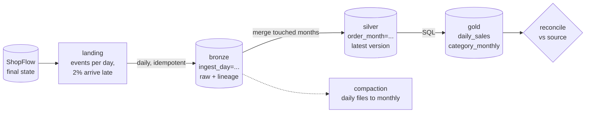
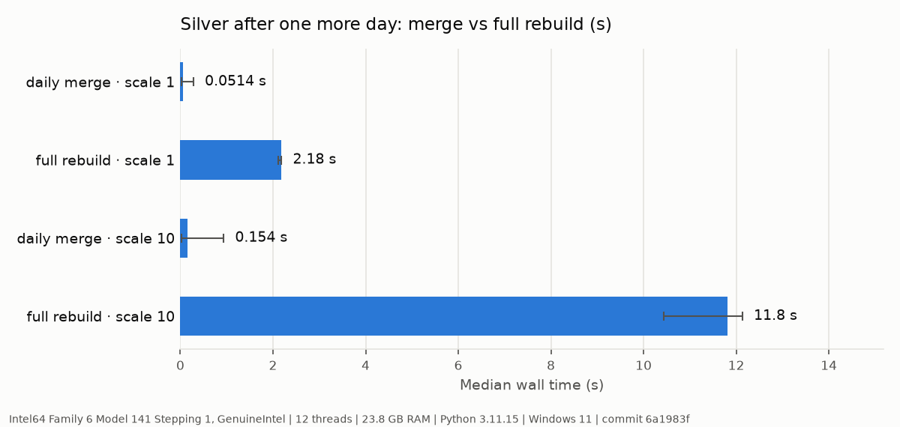
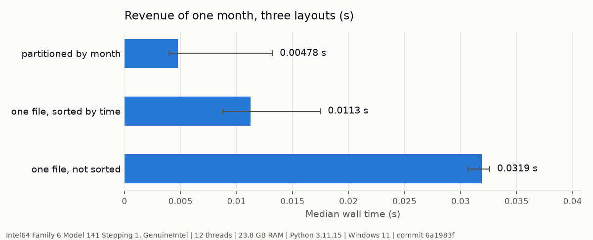
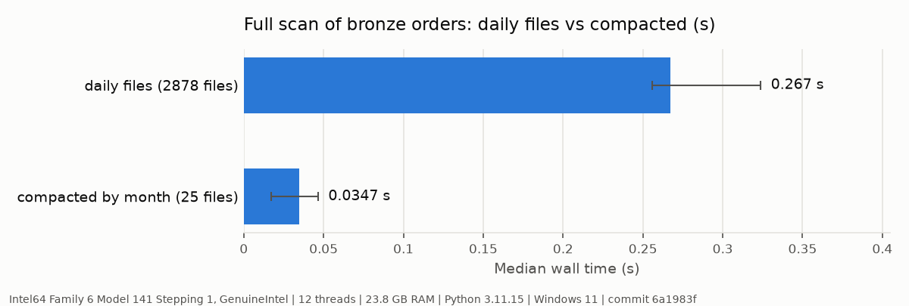

<p align="center">
  
</p>

<p align="center">
  <a href="https://github.com/silvano-moraes-de-souza/mini-lakehouse/actions/workflows/ci.yml"></a>
  
  
  
  
  <a href="https://github.com/silvano-moraes-de-souza/30-days-data-eng"></a>
</p>

> A lakehouse on plain Parquet files and DuckDB: daily drops land in bronze untouched, silver keeps the current version of every order partitioned by month, gold holds the tables people query. Events arrive late, orders change status after they are written, and the result still reconciles to the cent with the source.

<table>
<tr>
<td align="center"><b>0 orders off</b><br/>1M orders, 2 years of daily drops,<br/>revenue equal to the cent</td>
<td align="center"><b>77x</b><br/>daily merge 0.15 s vs<br/>full silver rebuild 11.8 s</td>
<td align="center"><b>6.7x</b><br/>one month from month partitions<br/>vs one unsorted file</td>
<td align="center"><b>7.7x</b><br/>full scan after compacting<br/>2,878 small files into 25</td>
</tr>
</table>

<sub>All numbers come from <a href="bench/run.py">bench/run.py</a> and <a href="results/">results/</a>.</sub>

**Contents:** [Problem](#problem) · [Architecture](#architecture) · [Quickstart](#quickstart) · [Results](#results) · [How it works](#how-it-works) · [Engineering decisions](#engineering-decisions) · [Tests](#tests) · [Limitations](#limitations)

## Problem

Most lakehouse demos load one clean file and draw three boxes. The hard parts only show up when data keeps arriving: an order is created on Monday, shipped on Tuesday, delivered next week, and the delivery event reaches the lake two days late because a driver's phone had no signal. The analytical copy has to end up with the right final state, rebuild only what changed, and stay fast to query as files pile up.

This project runs two years of [ShopFlow](https://github.com/silvano-moraes-de-souza/shopflow-datagen) orders through that, one day at a time, and checks the end result against the source.

## Architecture



## Quickstart

```bash
git clone https://github.com/silvano-moraes-de-souza/mini-lakehouse
cd mini-lakehouse
docker compose up --build    # small dataset, full run, prints the top categories
```

Without Docker:

```bash
uv sync
uv run pytest                                   # 16 tests
uv run lakehouse generate --scale 0.1 --out data/sf0.1
uv run lakehouse run --source data/sf0.1 --lake lake
uv run lakehouse sql --lake lake "SELECT * FROM gold.daily_sales ORDER BY day DESC LIMIT 5"
uv run python -m bench.run                      # rebuilds results/ and the charts
```

## Results

Measured on a laptop (Intel 11th gen Tiger Lake, 6 cores, 24 GB RAM, Windows 11, local SSD) with DuckDB 1.5.6. Every JSON in [`results/`](results/) records the machine and the commit it ran on.

### End to end: two years, one day at a time

| ShopFlow scale | Orders | Arrival days | Rows into bronze | Partitions rewritten | Total time | Orders different from source | Revenue difference |
|---|---:|---:|---:|---:|---:|---:|---:|
| 1 | 100,000 | 1,478 | 490,166 | 3,303 | 182 s | 0 | 0 cents |
| 10 | 1,000,000 | 1,479 | 4,874,648 | 3,355 | 480 s | 0 | 0 cents |

At scale 10 the gold revenue is R$ 308,657,200.74, the same as summing the source directly. The arrival days start in 2022 because customers signed up before the first order. A day's run (bronze + silver) has a median of 0.19 s and a p95 of 0.61 s at scale 10.

The reconciliation already earned its place once. The first full run did not match: nearly half of the orders were off at scale 10. DuckDB writes a large partition as several files (`data_0`, `data_1`, ...) and bronze was naming each copy after the batch only, so files of the same day overwrote each other. The small test datasets never produced a second file. The fix puts the source file name in the target name, a test now forces two files into one partition, and the benchmark refuses to save timings for a run that does not reconcile.

### Incremental merge vs full rebuild

Silver after one more day, merging only the touched month partitions, against recomputing silver from all of bronze.

| Scale | Daily merge (median of every day) | Full rebuild (median of 3) | Speedup |
|---|---:|---:|---:|
| 1 | 51 ms | 2.18 s | 42x |
| 10 | 154 ms | 11.8 s | 77x |



The rebuild grows with everything ever ingested; the merge grows with one day plus the months that late events touch. The gap widens with size.

### Partition pruning

Revenue of June 2025 from 1M silver orders, the same rows stored three ways, median of 7 runs. All three return the same total.

| Layout | Time |
|---|---:|
| Partitioned by month (`order_month=2025-06`) | 4.8 ms |
| One file, sorted by `ordered_at`, 100k-row groups | 11.3 ms |
| One file, sorted by `order_id` | 31.9 ms |



With partitions DuckDB opens one folder. With a sorted single file it still opens the file but skips row groups whose min and max `ordered_at` fall outside June. Unsorted, every row group has orders from every month, so nothing is skipped. Sorting gets most of the benefit even without partitions.

### Small files and compaction

A full scan of bronze orders (every version ever landed, scale 10), median of 7 runs.

| Layout | Files | Time |
|---|---:|---:|
| One file per arrival day | 2,878 | 267 ms |
| Compacted by month | 25 | 35 ms |



Same rows, same sums (checked by a test). The difference is the fixed cost of opening and reading the footer of each file.

## How it works

### Landing: the source as a stream of versions

ShopFlow stores the final state of each order. [`landing.py`](src/mini_lakehouse/landing.py) replays it as events: created (pending), shipped a day later, canceled after six hours, delivered at `delivered_at`, returned three days after delivery. Each event goes to the drop of the day it happened, except a seeded 2% that arrive one to five days late. Order items land with the order, customers on signup day, products once.

### Bronze: keep everything, add lineage

[`bronze.py`](src/mini_lakehouse/bronze.py) copies each landed file as it is, adding `_source_file`, `_batch_id` and `_ingested_at`. A manifest of ingested files makes it idempotent: running the same day twice writes nothing. Bronze is the replay log; silver can always be rebuilt from it.

### Silver: current state, rewritten one month at a time

[`silver.py`](src/mini_lakehouse/silver.py) keeps one row per order, the version with the latest `updated_at`. Only the month partitions that the day's batch touches are rewritten: a late delivery for March that lands in June rewrites March and nothing else. Each partition is written to a temporary file and swapped in with an atomic rename, so a failure halfway never leaves a broken partition.

### Gold and reconciliation

[`gold.py`](src/mini_lakehouse/gold.py) builds `daily_sales` and `category_monthly` with SQL over silver. `reconcile` then compares every silver order (status, total, delivery time) with the ShopFlow source, and gold revenue with revenue computed straight from the source.

### Compaction

One file per table per day adds up to hundreds of small files. [`compact.py`](src/mini_lakehouse/compact.py) rewrites them by month without losing a row; the benchmark measures what that buys.

## Engineering decisions

| Decision | Alternative | Why |
|---|---|---|
| Plain Parquet folders and DuckDB | Delta Lake, Iceberg | The point is to see what a table format solves. Atomic partition swaps, a manifest and a version column are the hand-made versions of what Delta and Iceberg give for free, with their limits visible. |
| Silver partitioned by business month (`ordered_at` in UTC-3) | By ingest date | Queries ask about months of sales, not about when a file arrived. Late events then rewrite an old month, which the merge handles. |
| Latest version by `updated_at`, ties broken by `_ingested_at` | Last ingested wins | A late event can be older than what silver already has. Ordering by event time makes arrival order irrelevant; a test sends an older version after a newer one. |
| Rewrite whole month partitions | Row-level updates | Parquet files are immutable. A month is 40k orders at scale 10, small enough to rewrite in milliseconds. |
| Write to a temp file, then `os.replace` | Write in place | A crash leaves the old partition, never half a file. |
| Bronze keeps everything, with lineage columns | Clean on ingest | Silver can be rebuilt after a bug; the rebuild is also the benchmark baseline and a test oracle. |
| Reconcile against the source on every run | Row counts | Counts would have missed the overwrite bug above, which dropped whole files but left plausible totals. |


## Tests

16 tests on Python 3.11, 3.12 and 3.13 in CI, plus a Docker job that runs the whole pipeline.

| What | How it is checked |
|---|---|
| End result | silver matches the source order by order, gold revenue matches to the cent |
| Landing | every status change becomes exactly one event; some events arrive late; two builds are identical |
| Bronze | ingesting the same day twice adds nothing |
| Silver | the incremental result equals a full rebuild from bronze; an older version arriving later does not overwrite a newer one, and only its month is rewritten |
| Compaction | same row count and same sum after rewriting |
| CLI | `sql` reads the silver and gold views |

## Limitations

- No concurrent writers. Two jobs merging the same month would race; a table format or a lock would be needed.
- No time travel. A rewritten partition replaces the old one; bronze can rebuild any past state, but not with a single query.
- Schema changes are not handled. A new column in the landing files would reach bronze and be dropped by silver.
- Late events older than a month still rewrite an old partition each time. Fine at this rate (2%), expensive if a source replays a year.
- Compaction runs on demand and writes to a separate folder; it is not wired into the daily job.
- The benchmark runs on a local SSD. Object storage (S3, GCS) has a much higher cost per file, so the small-files gap would be larger there, but that was not measured.


## Project structure

```
src/mini_lakehouse/
  landing.py     ShopFlow final state to daily event drops, with late arrivals
  bronze.py      idempotent raw ingest with lineage columns and a manifest
  silver.py      latest version per key, month partitions, atomic swaps
  gold.py        analyst tables and reconciliation with the source
  compact.py     small daily files to one file per month
  pipeline.py    the daily loop
  cli.py         lakehouse generate | run | sql
bench/           benchmarks and charts
results/         benchmark output (JSON, with machine and commit)
tests/
```

## Part of the series

Day 04 of [30 Days of Data & Software Engineering](https://github.com/silvano-moraes-de-souza/30-days-data-eng). Data from [shopflow-datagen](https://github.com/silvano-moraes-de-souza/shopflow-datagen) (day 00). The daily drops play the role of the change feed built in [postgres-cdc-pipeline](https://github.com/silvano-moraes-de-souza/postgres-cdc-pipeline) (day 03); the gold layer is what the analytics API on day 06 will serve.

## Author

**Silvano Moraes de Souza** · [LinkedIn](https://www.linkedin.com/in/silvano-moraes-de-souza) · [Portfolio](https://silvanomsouza.vercel.app/)
